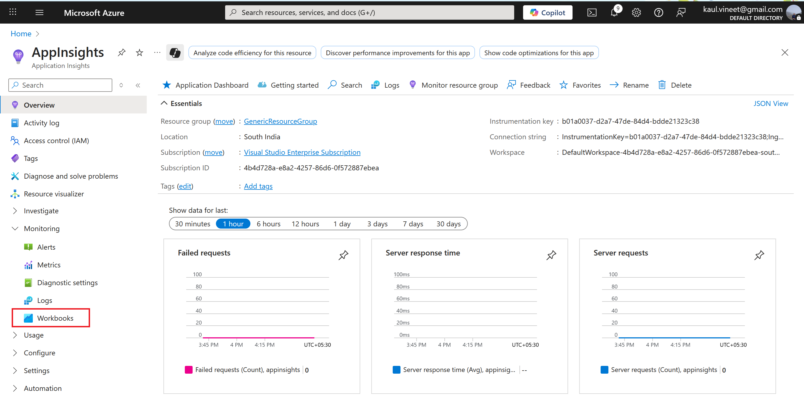

# MCS Observability using Azure App Insights

This repository provides a deployment-ready CPS dashboard template, complete with instructions for generating and monitoring system performance and operational metrics using App Insights.

## Authors

- [Ginette Vellera](gvellera@microsoft.com)
- [Linda M Thomas](lindamthomas@microsoft.com)
- [Daniel Heinze](Daniel.Heinze@microsoft.com)
## Deployment

To deploy this project follow the steps

### Assumptions
> [! IMPORTANT] This project support one Copilot agent linked to single instance of App Insights.

### Import Template
To import the CPS Dashboard Template into App Insights, follow these steps:
-  Navigate to the App Insights on Azure portal portal and create an instance.

 

 
  
 
 
	
-  Click on the newly created application insights instance. -> Click on Monitoring -> Click on Workbooks.

 

 
  
 
 
 
-  Click on New -> Advanced Editior icon
-  Copy the template content from the `cps_dashboard_template.workbook` file to Gallery Template.
-  Click on Apply.

### Create Dashboard
-  Go to Dashboard Hub on Azure Portal
-  Click on Create a Dashboard
-  Go to the workbook created previously and click on Pin All
-  Select the dashboard created in (1). You will also have option to create new dashboard here
-  Now restructure the tiles on the dashboard as per your requirement

## Sections and Metrics Overview
### 1. CPS Performance Metrics

A comprehensive view of system performance by summarizing key timing and error data. This section serves as the foundation for analyzing the health and efficiency of the CPS.

#### Key Metrics:
- **Flow, Connector, and Gen AI Execution Times**: Captures execution times for various flows, connectors, and AI-driven components.
- **90th Percentile Response Time (ms)**: Measures response time at the 90th percentile to understand high-latency edge cases.
- **Avg Response Time (ms)**: Provides the average response time for all requests.
- **Total Requests**: Counts the total number of requests handled by the system.
- **Throughput**: Measures the number of requests processed per unit time.
### 2. Error Monitoring

Tracks and analyzes errors occurring in the system, aiding in troubleshooting and improving reliability.

#### Key Metrics:
- **Error Count**: Total number of errors encountered.
- **Error Rate**: Percentage of requests resulting in errors.
- **Bot Error Rate**: Tracks errors specific to bot-related requests.
- **Error Logs**: Detailed logs of errors for in-depth debugging.
- **Conversations with Errors**: Identifies conversations where errors occurred for targeted analysis.

### 3. Response Time Analysis

Focuses on the response time performance to identify trends and anomalies.

#### Key Metrics:
- **Response Time Frequency**: Distribution of response times, filterable by time range, e.g., between `datetime("2024-11-05T23:00:00.000Z")..datetime("2024-11-05T23:30:00.000Z")`.
- **Topics by Max Response Time**: Highlights topics with the longest response times to target optimizations.

### 4. Correlation and Conversation Insights

Maps relationships between conversation IDs and correlation IDs to trace user interactions and system processes.

#### Key Metrics:
- **Conversation ID by Correlation ID**: Links conversation identifiers to correlation IDs for traceability.
- **Correlation ID by Conversation ID**: Reverse mapping for identifying system interactions linked to user conversations.
- **Steps for Given Conversation ID**: Breaks down the steps executed within a specific conversation.

### 5. Health and Reliability Monitoring

Tracks the overall health of the CPS system and highlights potential issues.

#### Key Metrics:
- **HealthCheck**: Status checks to ensure all services and components are operational.
## License

## Related

Here are some related projects

[Copilot telemetry](https://learn.microsoft.com/en-us/microsoft-copilot-studio/advanced-bot-framework-composer-capture-telemetry)